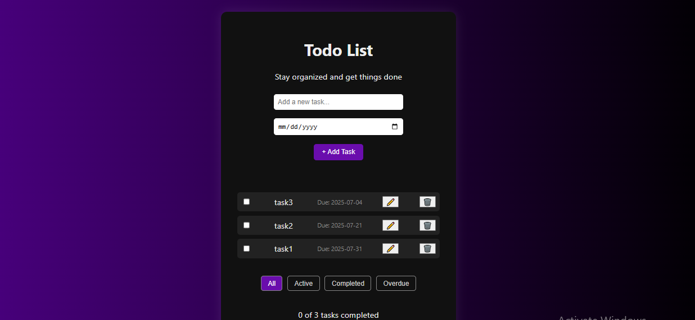

Here is an updated and detailed `README.md` file that includes **vertical screenshots** layout and **separate descriptions** for each feature:

---

````markdown
# 📝 Todo List App (React + TypeScript)

This is a **modern and interactive Todo List app** built using React, TypeScript, and Vite. It supports **task creation, editing, deletion, filtering**, and uses **localStorage** to persist data across page reloads.

---

## 🔧 Features

- ➕ Add a task with a name and due date.
- ✏️ Edit any task title and date.
- ✅ Mark tasks as completed.
- 🗑️ Delete tasks from the list.
- 🔍 Filter tasks by: All | Active | Completed | Overdue.
- 💾 Local storage saves tasks even after refreshing.
- ⚠️ Validation: Toast shows up when required fields are missing.

---

## 📸 Screenshots and Descriptions

### 1. No Task Added (Initial State)


**Description:**  
When no tasks are added, the app shows a centered message:  
`No tasks added`.  
This encourages users to create their first task.

---

### 2. Add Task



**Description:**  
A task is added by entering a task title and selecting a due date.  
Click **"+ Add Task"** to submit. The new task appears in the task list.

---

### 3. Edit Task


**Description:**  
Click the ✏️ icon to enter edit mode.  
You can change the title and due date.  
Blur or press Enter to save the updates.

---

### 4. Delete Task


**Description:**  
Click the 🗑️ icon to delete a task.  
This permanently removes it from the list and local storage.

---

### 5. Filter Tasks (All | Active | Completed | Overdue)


**Description:**  
Below the task list, users can filter tasks:  
- **All**: Show all tasks.  
- **Active**: Tasks not completed.  
- **Completed**: Tasks marked done.  
- **Overdue**: Tasks with due dates in the past and not completed.

Each filter dynamically updates the task view.

---


## Getting Started

### 1. Clone the Project

```bash
git clone https://github.com/your-username/todo-app.git
cd todo-app
````

### 2. Install Dependencies

```bash
npm install
```

### 3. Start the Development Server

```bash
npm run dev
```

Open in browser:
👉 [http://localhost:5173](http://localhost:5173)


## Tech Stack

* React
* TypeScript
* Vite
* CSS
* react-toastify 


## 📜 License

This project is MIT licensed.


by Fenet Damena